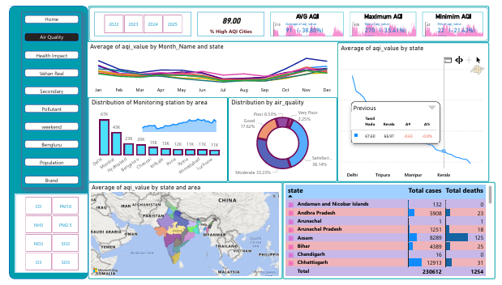

# Market Research for  Air Purifier
 This challenge is powered by DataFul, our official data partner, providing real-time AQI and health datasets. With their support, AirPure Innovations is exploring the true market need for air purifiers.
🌏 Air Quality, Health & EV Insights — Power BI Dashboard
Author: Shweta
Tech Stack: Power BI, DAX, Data Cleaning & Modeling

📌 Overview
This interactive Power BI Dashboard combines Air Quality Index (AQI), health impact data, electric vehicle penetration, and market trends to provide data-driven insights for policymakers, healthcare professionals, and businesses in the clean air industry.

The project answers key questions such as:

Which cities are at the highest risk due to air pollution?

How does air quality vary by region, pollutant type, and season?

Does EV adoption actually improve air quality?

How does poor AQI affect public health and consumer behavior?

🛠 Data Sources
AQI Data: Monitoring station readings across Indian states & cities.

Health Data: Reported cases of waterborne/vector-borne diseases.

EV Registration Data: State-wise EV penetration rates.

Market Data: Air purifier sales, brand performance, and feature gaps.

Population Data: 2024 city-wise demographics.

📊 Dashboard Pages & Features
1️⃣ Air Quality Overview
Heatmaps & Trends: Identify most polluted states and seasonal variations.

Pollutant Breakdown: See dominant pollutants by state (PM2.5, PM10, NO₂, etc.).

Weekend vs. Weekday AQI: Detect work-week traffic influence.

Key Insight:

Delhi’s AQI remains consistently poor, with minimal improvement on weekends, showing pollution sources beyond just traffic.

2️⃣ Health Impact
Disease–AQI Correlation: Map high AQI areas with disease outbreaks.

Cost Analysis: Average treatment cost by disease type.

Case Trends: See if spikes in AQI align with spikes in health cases.

Key Insight:

High PM10 & PM2.5 regions see more respiratory and vector-borne illnesses, especially during pre-monsoon months.

3️⃣ EV Penetration & AQI
State EV Rankings: Rank states by EV adoption.

AQI Comparison: High-EV states vs. low-EV states.

Key Insight:

States like Delhi & Chandigarh have high EV penetration, but AQI improvement is minimal, suggesting EVs alone won’t fix air quality without industrial and construction reforms.

4️⃣ Market & Consumer Trends
Air Purifier Sales: Brand market share, sales volumes, and price positioning.

Pollution Emergencies: Link AQI spikes with online search trends for "Air Purifier".

Key Insight:

Search interest for air purifiers spikes during severe AQI events, showing reactive buying behavior rather than proactive health measures.

5️⃣ City Risk Score & Recommendations
Choropleth Map: City risk score combining AQI, health data, and demand potential.

Top 10 Risk Cities: Data table with AQI, health cases, and EV penetration.

Action Recommendations: Data-driven suggestions for targeted interventions.

Key Insight:

Byrnihat, Delhi, Hajipur are high-priority cities for intervention due to extremely poor AQI and low green infrastructure readiness.

📈 Key Findings Summary
AQI Seasonality: Winter & post-harvest months show the worst air quality in most states.

Health Risks: PM10 & PM2.5 dominant states also have higher asthma & respiratory illness rates.

EV Effect: Higher EV penetration doesn’t always mean cleaner air—industrial and dust sources are major contributors.

Consumer Behavior: Air purifier demand is event-driven, not preventive.

High-Risk Cities: Several Tier-2 cities now match metro pollution levels.

🚀 How to Use the Dashboard
Open Power BI Desktop.

Load the .pbix file from the repo.

Use slicers to filter by:

Year / Date Range

State / City

Pollutant Type

Disease Category

Navigate through pages using the page tabs at the bottom.

📌 Next Steps / Future Enhancements
Integrate real-time AQI APIs for live dashboards.

Add hospital admission data for deeper health impact analysis.

Predictive modeling for future AQI trends.
Drive link : https://drive.google.com/drive/folders/1SkGbkzQpn111ALNP-QJQ8glr0Q2ktGGq?usp=sharing

⭐ If you like this project
Please ⭐ the repo and share your feedback.

